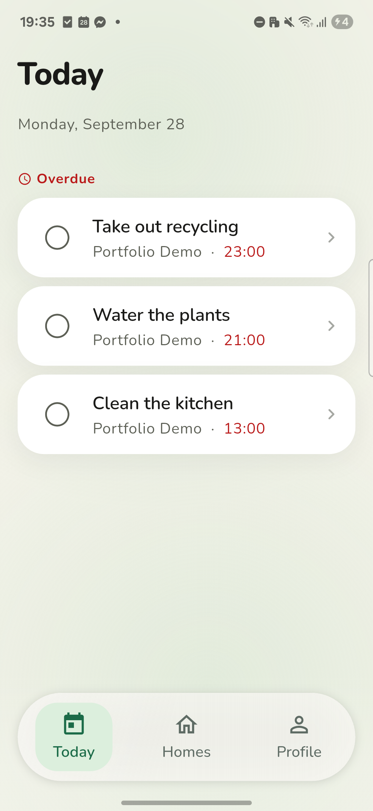
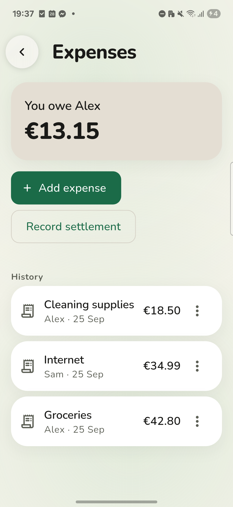
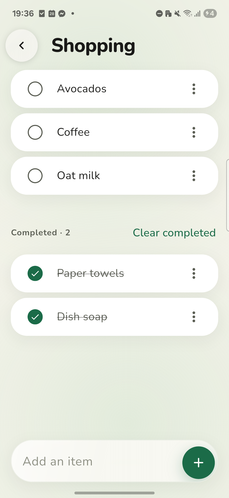
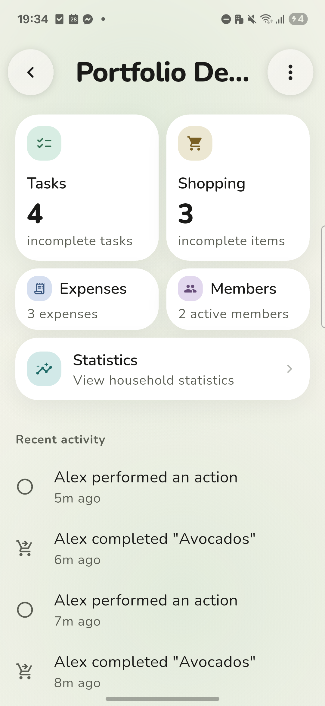
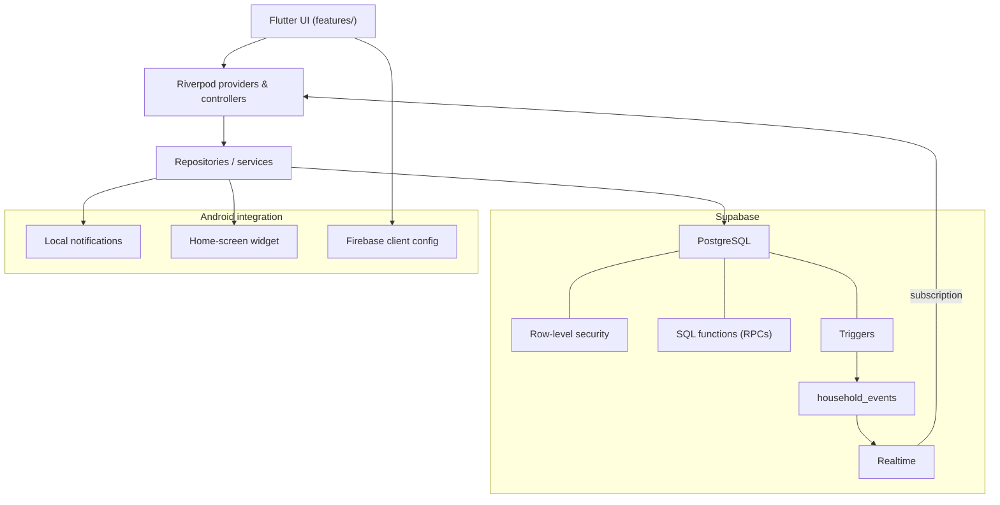

# Household OS

Tasks, shopping, and expenses for your household, synced live across everyone in it.

[](https://flutter.dev)
[](https://dart.dev)
[](https://supabase.com)
[](https://github.com/mikhailesemchik-ui/HouseHold/releases/tag/v1.0.0)
[](https://github.com/mikhailesemchik-ui/HouseHold/releases/tag/v1.0.0)
[](#reliability)

### Download

**[Download Household OS for Android](https://github.com/mikhailesemchik-ui/HouseHold/releases/download/v1.0.0/Household-OS-v1.0.0-arm64.apk)**
`Android ARM64 · v1.0.0`

Android will ask you to allow installation from your browser or file manager — the app is distributed directly, not through Google Play.

<p align="center">
  
  
</p>
<p align="center">
  
  
</p>

## Overview

A household shares chores, groceries, and bills, but not a record of any of it. Household OS gives it one: what's due, what's needed, who owes whom, kept current as anyone in the household makes a change.

Open the app, see what needs attention, do one thing, leave. There's no backlog or project board — just a Today list, a shopping list, and a running balance. One account can belong to several households (a flat, a family home) and switch between them from Homes.

## Features

- **Today** — overdue, due today, upcoming, and anytime tasks, across every household at once.
- **Tasks** — one-off or recurring, with due dates, assignment, and completion history.
- **Shopping** — a shared list split into active and completed items.
- **Expenses** — who paid, the split, and the resulting balance, with settlements to clear a debt.
- **Dashboard** — live counts and a recent-activity feed per household.
- **Members** — invite by code, transfer ownership, remove a member.
- **Statistics** — completion trends and task-rotation suggestions.
- **Reminders & widget** — local notifications for due tasks, plus a home-screen widget.

## Architecture



- **State** — Riverpod 3: `StreamProvider`s over Supabase Realtime for live data, `AsyncNotifier`/`FutureProvider` for mutations and one-shot fetches.
- **Navigation** — `go_router`, a shell route for the bottom nav, full-screen modals for forms.
- **Backend** — Supabase Postgres, row-level security scoped to a user's households, SQL functions (RPCs) for multi-step writes, triggers that log a `household_events` row per change, Realtime for delivery.
- **Platform services** — `flutter_local_notifications` for reminders (reboot-safe rescheduling), `home_widget` backing a native `AppWidgetProvider`, Firebase Cloud Messaging client config for future push.

## Realtime collaboration

A mutation writes to Postgres, a trigger logs a `household_events` row, and Supabase Realtime pushes it to every member's client. Each screen invalidates only the Riverpod providers that event could affect — a dashboard count, a member list, an assignment picker — so the UI updates without a manual refresh. Verified across a physical device and an emulator running as two separate household members at once.

## Task model

```
Task definition → occurrence → per-instance completion
```

A task and its schedule are separate from any single completion. A recurring task generates occurrences, and completing one finishes that occurrence, not the task itself — recurrence history and future instances stay intact. A task with no due date just completes directly. This is what lets "water the plants every Monday" and "call the landlord, whenever" share the same model.

## Expenses

An expense has a payer, an amount, and the members it's split between (equal split). Every expense and settlement in a household rolls up into one net balance per pair of members — "you owe" or "owed to you." Recording a settlement clears it; deleting one restores it. Both update live.

## Identity & access

Household OS skips the signup form. Open the app, create or join a household, and you're in — no email or password required up front. An optional display name and avatar can be added later from Profile.

Under the hood, that initial identity is Supabase anonymous auth. Members appear in the UI as short public codes, not raw database IDs, and every table is scoped by row-level security to the households a user actually belongs to.

This is backend-enforced access control, not end-to-end encryption — there's no account-recovery flow yet if a device is lost.

## Android integration

- Scheduled local reminders for due tasks, with reboot-safe rescheduling.
- Notification permission handling for Android 13+.
- A home-screen widget backed by a native `AppWidgetProvider`.
- State refresh on app resume, not just on first load.

The codebase builds for iOS; these integrations haven't been validated there yet.

## Reliability

| Check | Result |
|---|---|
| `flutter analyze` | clean |
| `flutter test` | 523/523 passing |
| Multi-device realtime sync | verified (physical device + emulator, two identities) |
| Offline startup | shows retry, not a blank screen or crash |
| App-resume refresh | verified |

## Tech stack

| Layer | Technology |
|---|---|
| App | Flutter, Dart |
| State | Riverpod 3 |
| Routing | go_router |
| Backend | Supabase (PostgreSQL, RLS, Realtime, SQL functions) |
| Notifications | flutter_local_notifications, Firebase Cloud Messaging (Android) |
| Home-screen widget | home_widget + native Android `AppWidgetProvider` |
| Identity | Supabase anonymous auth |

## Run locally

Requires Flutter stable and an Android SDK.

```bash
flutter pub get

flutter run \
  --dart-define=SUPABASE_URL=<project-url> \
  --dart-define=SUPABASE_ANON_KEY=<publishable-key>
```

## Platform

Android is the current release target: v1.0.0, ARM64, validated on physical hardware. iOS builds from the same codebase; device validation there hasn't happened yet.
