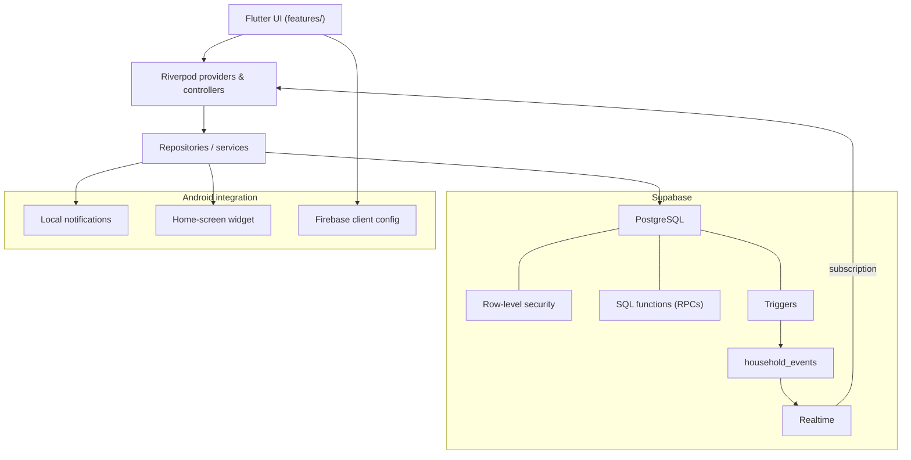

# Household OS

A collaborative household-management app for couples, families, and roommates — Flutter + Supabase, with real multi-user realtime sync.

Open it, see what needs attention, do one small thing, leave. Not a project-management tool wearing a home-life skin.

**Download:** Android APK release coming in the final packaging step.

<p align="center">
  
  
</p>
<p align="center">
  
  
</p>

## Overview

Households already share a real life — chores, groceries, bills, a place to
live — but not a shared source of truth for any of it. Household OS gives a
household one place to see what's due, what's needed, and who owes whom,
updated live as anyone in the household makes a change.

The interaction model is deliberately narrow: open the app, see the current
state, take one action, close it. There's no project board, no backlog, no
configuration to maintain — just Today's list, the shopping list, and the
running expense balance.

A person can belong to more than one household (e.g. a shared flat and a
family home) and switch between them from the Homes screen.

## Features

- **Today** — a single cross-household feed of what's due: overdue, due
  today, upcoming, and anytime tasks.
- **Tasks** — one-off or recurring, with due dates, assignment, and
  completion history.
- **Shopping** — a shared list with active and completed sections.
- **Expenses** — who paid, how it's split, and the resulting balance between
  members, with settlements to clear a debt.
- **Household dashboard** — live counts (tasks, shopping, expenses, members)
  and a recent-activity feed of what everyone's been doing.
- **Members** — invite by code, transfer ownership, remove a member.
- **Statistics** — completion trends and task-rotation suggestions per
  member.
- **Reminders & widget** — local notifications for due tasks and an Android
  home-screen widget showing what's outstanding.

## Architecture



- **State**: Riverpod 3 throughout — `StreamProvider`s over Supabase Realtime
  for live data, `AsyncNotifier`/`FutureProvider` for mutations and one-shot
  fetches.
- **Navigation**: `go_router` with a shell route (bottom nav) and
  full-screen modal routes for forms.
- **Backend**: Supabase — PostgreSQL with row-level security scoping every
  table to a user's active households, SQL functions (RPCs) for multi-step
  writes (join a household, complete an occurrence, transfer ownership),
  triggers that record a `household_events` row on meaningful changes, and
  Realtime for live sync.
- **Platform services**: `flutter_local_notifications` for due-task
  reminders (with reboot-safe rescheduling), `home_widget` backing a native
  Android `AppWidgetProvider`, and Firebase Cloud Messaging client
  configuration for future push notifications.

## Realtime collaboration

Every meaningful change in a household — a task created or completed, an
item checked off, an expense added, a member joining or leaving — is
recorded server-side as a household event and broadcast over Supabase
Realtime to every active member's client.

Clients don't poll. A screen watching a household subscribes to that
event stream and invalidates only the Riverpod providers a given event type
could have affected — the dashboard summary, the member list, task
assignment options — so the UI reflects the change without a manual refresh
or app restart, on every device in the household.

## Task model

A task definition and its schedule are separate concepts. A one-off or
recurring task generates one or more **occurrences** — each a concrete
scheduled instance with its own completion state. Completing a task
completes today's occurrence, not the definition, so recurrence history and
future instances stay intact. A task with no due date completes directly, no
occurrence needed. This split is what lets "water the plants every Monday"
and "call the landlord, whenever" both work correctly with one due-date
model.

## Expenses

An expense records who paid, its amount, and which members it's split
between (equal split). The app aggregates every expense and settlement in a
household into a single net balance per pair of members, shown as "you owe"
or "owed to you." Recording a settlement clears the debt; deleting one
restores it — both update live for every member.

## Identity, security & privacy

- **Anonymous-first authentication** via Supabase — no mandatory email or
  password to start using the app.
- An optional display name and avatar can be set from Profile; nothing else
  is required.
- Members are referred to by short, human-readable codes in the UI rather
  than exposing raw database UUIDs.
- Every table is scoped by Supabase row-level security to the households a
  user actually belongs to.
- Client configuration is minimal: a project URL and a publishable anon key,
  passed in at build time.

This is standard backend-enforced access control, not end-to-end encryption
or a local-first/zero-knowledge design, and there's no account-recovery flow
yet.

## Android integration

- Release-mode Android builds, verified on physical hardware.
- Scheduled local reminders for due tasks, with reboot-safe rescheduling.
- Notification handling on Android 13+ (`POST_NOTIFICATIONS`).
- A home-screen widget backed by a native `AppWidgetProvider`, kept in sync
  with app state.
- Lifecycle-aware refresh on app resume.

iOS is not covered by this list — the codebase builds for iOS, but these
integrations haven't gone through the same device validation there.

## Reliability

- **523 automated tests** (`flutter test`), plus `flutter analyze` clean, as
  the current verified baseline.
- **Physical multi-device validation**: the app has been run and exercised
  on a physical Android phone and an Android emulator simultaneously, as two
  independent real identities in the same household, covering multi-user
  realtime sync, task/shopping completion and reopening, expense balances,
  member join/leave, app-resume/lifecycle behavior, offline startup and
  recovery, local reminders, the home-screen widget, and a release-mode
  build.
- **Lifecycle-aware refresh**: household state refreshes on app resume, not
  just on first load, so data that changed while the app was backgrounded
  is caught up automatically.
- **Recoverable offline states**: a connection failure on startup shows a
  retry action instead of an indefinite loading state or a crash.

This is ongoing device-based QA, not a formal certification — the goal is a
mobile app that behaves correctly under real multi-user, real-network
conditions, not just in isolated widget tests.

## Tech stack

| Layer | Technology |
|---|---|
| App | Flutter, Dart |
| State | Riverpod 3 |
| Routing | go_router |
| Backend | Supabase (PostgreSQL, RLS, Realtime, SQL functions) |
| Notifications | flutter_local_notifications, Firebase Cloud Messaging (Android) |
| Home-screen widget | home_widget + native Android `AppWidgetProvider` |
| Identity | Supabase anonymous auth |

## Getting started

Requires Flutter (stable) and an Android SDK. The app reads its Supabase
project from compile-time defines; a build without them fails fast at
startup rather than silently pointing at the wrong project:

- `SUPABASE_URL`
- `SUPABASE_ANON_KEY` — the publishable client key, not a server secret

```bash
flutter pub get

# debug run
flutter run \
  --dart-define=SUPABASE_URL=<project-url> \
  --dart-define=SUPABASE_ANON_KEY=<publishable-key>

# release APK
flutter build apk --release \
  --dart-define=SUPABASE_URL=<project-url> \
  --dart-define=SUPABASE_ANON_KEY=<publishable-key>
```

### Firebase Android config

`android/app/google-services.json` is committed intentionally, for a
reproducible Android build from a clean checkout. It's ordinary Firebase
client configuration (project ID, package name, public API key) — not a
private credential.

## Project status

This is a portfolio project, not a universally production-ready product.
Android is the currently validated target — release-mode Android builds
have been tested end to end on physical hardware. Packaging a downloadable
GitHub Release APK is the next and final step. iOS validation is deferred to
a later, separate phase.
